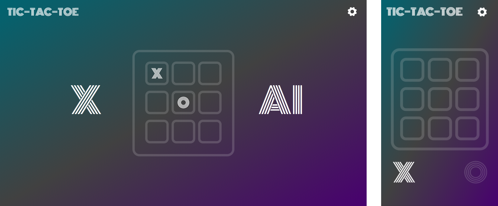

# Tic-Tac-Toe-Game
*Tic-tac-toe (also known as noughts and crosses or Xs and Os) is a paper-and-pencil game for two players, X and O, who take turns marking the spaces in a 3×3 grid. The player who succeeds in placing three of their marks in a horizontal, vertical, or diagonal row wins the game.*

<h2> UI </h2>
 

<h2> AI<i>-MINIMAX</i> </h2>

*Minimax is a recursive algorithm which is used to choose an optimal move for a player assuming that the opponent is also playing optimally. As its name suggests, its goal is to minimize the maximum loss (minimize the worst case scenario).

For example, let's say it's X's turn and X plays a particular move. What's the value of this move? Suppose that O can respond in one of two ways: In the first case, O wins on the next move. The other move by O leads to a win by X on the following move. Since O can win, we consider the original move by X a bad one - it leads to a loss. We ignore the fact that X could win if O makes a mistake. We'll define a value of 10 for a win by X, -10 for a win by O, and 0 for a draw. In the above scenario, since O can win on the next move, the original move by X is assigned a value of -10.

The minimax algorithm applies this strategy recursively from any given position - we explore the game from a given starting position until we reach all possible end-of-game states. We can represent this as a tree, with each level of the tree showing the possible board positions for a given player's turn. When we reach an end-of-game state, there's no choice to be made, so the value is the game result, that is 10 if X won, -10 if O won, and 0 if it was a draw. If it is X's turn and it's not a final board state, we choose the maximum of the values of the next possible moves from that position in the tree. This represents the best possible option for X. If it is O's turn, then we choose the minimum of these values, which is the best option for O. We keep propagating the position values upward toward the root position, alternating between maximum and minimum values.*

for more information see-
  * Wikipedia: https://en.wikipedia.org/wiki/Minimax
  
  An implementation of Minimax AI Algorithm on Tic-Tac-Toe
